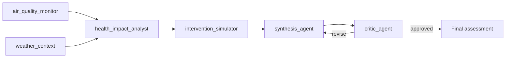

# Architecture

> :material-graph-outline: [Open the interactive runtime architecture diagram](architecture-diagram.html)
> — explorable HTML generated from this repository's actual source (components link back to
> the exact file/line evidence).

```
frontend/  React + Vite SPA
  MapView            -> picks LeafletMap (default) or GoogleMap (if VITE_GOOGLE_MAPS_API_KEY set)
  LeafletMap           -> plain Leaflet + OSM tiles, markers color-coded by AQI, click to select
  GoogleMap            -> optional: real Google Maps JS API, same markers/colors
  SatelliteLayer        -> optional: Earth Engine RGB/NDVI toggle, or an honest "not available" note
  CorridorList        -> India-first corridor picker + "N Indian states" stat + India-only filter
  AgentTrace          -> live SSE agent-by-agent trace with a pulsing "active agent" indicator
  AqiDashboard         -> big AQI number/badge, inline-SVG pollutant bars, 48h sparkline
  SimulationPanel      -> debounced what-if sliders, baseline-vs-projected AQI comparison
  AlertsPanel          -> the proactive advisory, styled distinctly, or a calm "no alerts" state
  SpeakableText         -> SpeechSynthesis read-aloud + EN/HI/TA language toggle

backend/   Python FastAPI + google-adk (port 8788 in dev)
  agent.py         ADK pipeline: air_quality_monitor + weather_context (ParallelAgent)
                   -> health_impact_analyst -> intervention_simulator
                   -> synthesis_agent + critic_agent (LoopAgent, max 2 iterations, exit_loop tool)
  tools.py         fetch_air_quality/fetch_weather (real Open-Meteo calls, 8s timeout,
                   cached_baseline fallback), estimate_health_risk, simulate_intervention
                   (deterministic heuristics), maybe_draft_alert (proactive escalation,
                   not an LLM call)
  earth_engine.py  optional: real Sentinel-2 true-color + NDVI tiles via Earth Engine, or
                   a clean EE_AVAILABLE=False + honest reason if it isn't configured
  main.py          FastAPI app: REST + SSE endpoints, then a catch-all serving the built
                   frontend

  data/corridors.json   BRICS corridor dataset (lat/lng, baseline AQI, wind, humidity,
                         cross-border/neighbor graph, and a mock sensitive_sites_estimate —
                         schools+hospitals+eldercare)
```

## Two modes, chosen automatically by whether Gemini is reachable

- **`gemini`**: runs the real ADK `Runner`/`LlmAgent` pipeline, via either
  `GEMINI_API_KEY` (Google AI Studio) or — when an org policy disallows API keys
  entirely — **Vertex AI + Application Default Credentials**: set
  `GOOGLE_GENAI_USE_VERTEXAI=TRUE` plus `GOOGLE_CLOUD_PROJECT`/`GOOGLE_CLOUD_LOCATION`
  and grant the Cloud Run service's own service account the `roles/aiplatform.user`
  role — `deploy.sh` does all three automatically when no `GEMINI_API_KEY` is provided.
  No key of any kind is needed either way. If a live call fails for any reason (IAM
  still propagating, no ADC available, quota, network), every endpoint that would have
  used it catches the failure and falls back to the same real-data offline path below,
  reporting `"mode": "offline"` rather than erroring.
- **`offline`** (no key): the ADK pipeline is skipped, but `fetch_air_quality`,
  `fetch_weather`, `estimate_health_risk`, `simulate_intervention`, and
  `maybe_draft_alert` are called directly as plain Python — the fetched numbers are
  still 100% real; only the LLM reasoning/narration layer is replaced by a deterministic
  template.

In both modes, the structured response fields (`air_quality`, `weather`, `health_risk`,
`simulation`, `alert`) come from direct calls to the same tool functions, so they are
always correct and fast; in `gemini` mode the ADK pipeline additionally runs end-to-end
to produce the `narrative` and the live `trace`.

## Multi-agent pipeline



`air_quality_monitor` and `weather_context` run in parallel (`ParallelAgent`) against
live Open-Meteo data. `synthesis_agent` and `critic_agent` run inside a `LoopAgent`
(max 2 iterations) — the critic can send the synthesis back for revision if it's
internally inconsistent (e.g. claiming "safe" air quality while AQI is in a hazardous
band) before the loop exits via the `exit_loop` tool.

## Design notes / what a production build would add

- **Real facility-registry data.** `sensitive_sites_estimate` (schools/hospitals/
  eldercare counts per corridor) is hand-authored mock data; production would pull this
  from a real facility-registry GIS layer per state/country.
- **A less simplistic intervention model.** `simulate_intervention`'s linear heuristic
  stands in for a real emissions-inventory / atmospheric-dispersion model.
- **True cross-border interoperability.** Each BRICS nation would run its own instance
  against its own data, with a federated protocol for exchanging anonymized
  hotspot/forecast signal across borders without sharing raw citizen or sensor data.
- **Authority routing & acknowledgement tracking.** A production alert would route to
  the actual responsible agency via SMS/email/webhook with acknowledgement tracking.
- **Full i18n and richer voice support.** The language toggle currently covers the
  narrative and advisory text (English/Hindi/Tamil); a production build would extend
  translation to the full UI and add `SpeechRecognition` voice input.
